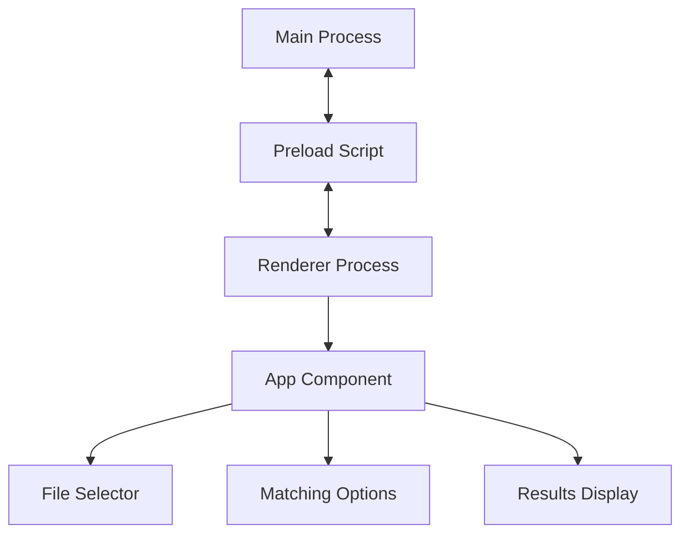
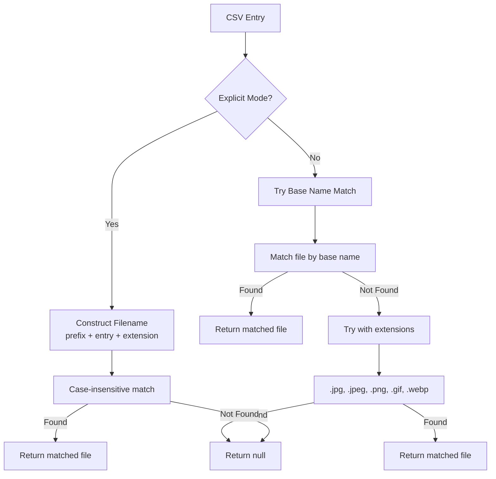

# System Patterns

## Architecture

- Main Process (Node.js)
  - File system operations
  - Native dialog handling
  - CSV parsing
  - Image copying
- Renderer Process (React)
  - UI presentation
  - State management
  - IPC communication

## Component Relationships

## Electron Packaging

- Use Electron Forge with extraResource config for renderer assets
- Always build renderer before packaging main process
- Include error handling for production path loading
- Configure multiple platform builds (macOS, Windows)

## Critical Paths

1. File Selection Flow:
   User → Select CSV → IPC → Main Process → Native Dialog → Path to Renderer

2. Copy Process:
   User → Start Copy → IPC → Main Process → Read CSV → Match Files → Copy Images → Results to Renderer

## Path Resolution Pattern

- **Production Build Loading**:
  - First checks relative path (for dev testing)
  - Falls back to packaged app path
  - Uses fs.existsSync to verify path
- **Asset Loading**:
  - Vite builds assets to /dist
  - Uses hashed filenames for cache busting
  - Base path set to './' for relative loading

## Filename Resolution Algorithm

### Key Characteristics

- Case-insensitive matching
- Supports filenames with or without extensions
- Preserves original filename casing in destination
- Flexible mode tries base name first, then extensions
<<<<<<< HEAD
- Explicit mode constructs filenames with prefix/suffix
=======
- Explicit mode constructs filenames with prefix/suffix
>>>>>>> dc474c1 (Sanity commit)
